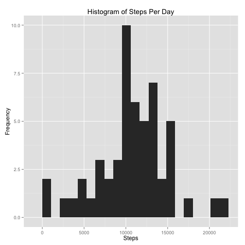
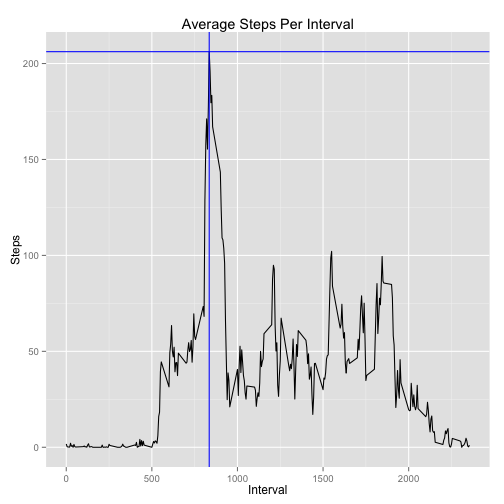
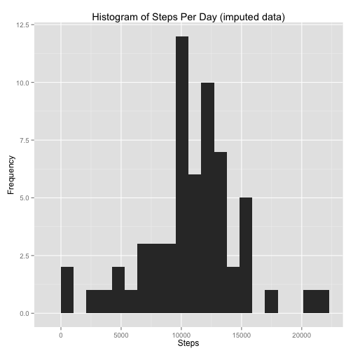
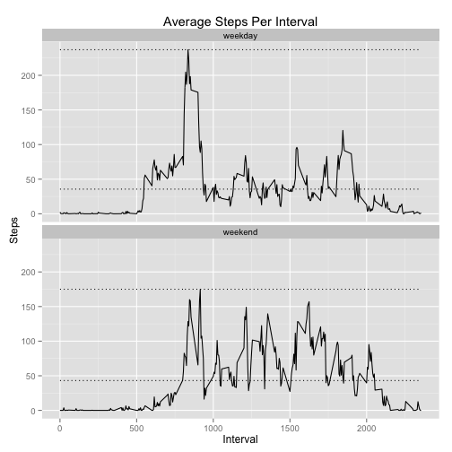

# Reproducible Research: Peer Assessment 1


## Loading and preprocessing the data

This assignment utilizes the source data file from:

https://d396qusza40orc.cloudfront.net/repdata%2Fdata%2Factivity.zip

Although the file is already available within the repository, first check whether `activity.csv` file exists. If not, the code:

- Downloads a new zip file into a local copy with **today's date**
- Unzips the file and reads it into a dataframe.

Given the appropriate csv, use `read.csv()` to read file. Finally, convert date string into a date format for future manipulation.


```r
options(scipen=999) # Disable scientific notation in output
if (!file.exists("activity.csv")) {
        zipfileurl <- "https://d396qusza40orc.cloudfront.net/repdata%2Fdata%2Factivity.zip"
        zipfilename <- paste0("rep-data-activity-",strftime(Sys.time(),"%Y%m%d"),".zip")
        download.file(url=zipfileurl,destfile=zipfilename,method="curl")
        unzip(zipfile=zipfilename)
}

activity <- read.csv("activity.csv",stringsAsFactors=FALSE)
activity$date <- as.Date(activity$date)
```

## What is mean total number of steps taken per day?

Create a new dataframe for the steps per day with the `ddply` from the `plyr` package. The results are a summarized dataframe with the total steps per day.


```r
library(plyr)
stepsperday <- ddply(activity, .(date),summarise,steps=sum(steps))
```

Plot the histogram of the number of steps per day. A bin width of a $max\:steps\over{20}$ was selected after various exploratory graphs.


```r
library(ggplot2)
ggplot(stepsperday,aes(steps)) + 
        geom_histogram(binwidth=max(stepsperday$steps,na.rm=TRUE)/20) +
        labs(title="Histogram of Steps Per Day",x="Steps",y="Frequency")
```

 

Find the mean and median. Since the data includes a number of missing observations, utilize `na.rm=TRUE`


```r
meanperday <- mean(stepsperday$steps,na.rm=TRUE)
medianperday <- median(stepsperday$steps,na.rm=TRUE)
meanperday
```

```
## [1] 10766
```

```r
medianperday
```

```
## [1] 10765
```

The mean is **10766.1887** and the median is **10765**.

## What is the average daily activity pattern?

Leverage `ddply` again, this time to average the steps per interval. Next `which.max` simplifies finding the interval with the highest average. For the plot, the blue lines highlight the location of the max and its interval.


```r
stepsperinterval <- ddply(activity,.(interval),summarise,steps=mean(steps,na.rm=TRUE))
indexofmax <- which.max(stepsperinterval$steps)
maxinterval <- stepsperinterval[indexofmax,"interval"]
maxsteps <- stepsperinterval[indexofmax,"steps"]

ggplot(stepsperinterval,aes(interval,steps)) +
        geom_line() +
        geom_hline(aes(yintercept=maxsteps),color="blue") +
        geom_vline(xintercept=maxinterval,color="blue") +
        labs(title="Average Steps Per Interval",x="Interval",y="Steps")
```

 

The interval with the greatest average number of steps was **835** with **206.1698** steps.

## Imputing missing values

First, find the number of observations with missing values (**`NA`**)


```r
missingcount <- sum(!complete.cases(activity))
```

With 2304 missing observations, let's see if there is a pattern. Summarising the missing values by date provides:


```r
missingintervalcount <- ddply(activity,.(date),summarise,missing=sum(is.na(steps)))
missingintervalcount[missingintervalcount$missing>0,]
```

```
##          date missing
## 1  2012-10-01     288
## 8  2012-10-08     288
## 32 2012-11-01     288
## 35 2012-11-04     288
## 40 2012-11-09     288
## 41 2012-11-10     288
## 45 2012-11-14     288
## 61 2012-11-30     288
```

Given that there are 288 five minute intervals in a day - the pattern of missing data is all the data on a given day. Perhaps imputing the missing intervals with the average intervals for the same day of the week for the same interval is a good approach since individual movement patterns tend to be cyclical by week. First, assign the week day to date column and summarize the missing steps by the week day. 


```r
activity$day <- weekdays.Date(activity$date)
ddply(activity,.(day),summarise,missing=sum(is.na(steps)))
```

```
##         day missing
## 1    Friday     576
## 2    Monday     576
## 3  Saturday     288
## 4    Sunday     288
## 5  Thursday     288
## 6   Tuesday       0
## 7 Wednesday     288
```

This shows us that at most, 2 days are missing for any given week day with Tuesday not having any missing data. Next, create a new data frame with means for each interval and each week day. This is used to merge into the new `imputed` data frame.


```r
weekdaymeans <- ddply(activity,.(day,interval),summarise,meanstepweekday=mean(steps,na.rm=TRUE))
imputed <- merge(activity,weekdaymeans,by=c("day","interval"))
imputed$steps[is.na(imputed$steps)] <- imputed$meanstepweekday[is.na(imputed$steps)]
imputed$meanstepweekday <- NULL
```

Now, a new histogram, mean and median with the `imputed` activity data.


```r
imputedstepsperday <- ddply(imputed, .(date),summarise,steps=sum(steps))

library(ggplot2)
ggplot(imputedstepsperday,aes(steps)) + 
        geom_histogram(binwidth=max(imputedstepsperday$steps,na.rm=TRUE)/20) +
        labs(title="Histogram of Steps Per Day (imputed data)",x="Steps",y="Frequency")
```

 


```r
imputedmeanperday <- mean(imputedstepsperday$steps)
imputedmedianperday <- median(imputedstepsperday$steps)
imputedmeanperday
```

```
## [1] 10821
```

```r
imputedmedianperday
```

```
## [1] 11015
```

The mean of the imputed data is **10821.2096** and the median is **11015**. Compared to the results from the original dataset, removing the `NA` had a mean of **10766.1887** and a median of **10765** - so both the mean and median increased by a small amount after imputing the data with this method.

## Are there differences in activity patterns between weekdays and weekends?

Create a new `daytype` variable to categorize weekday versus weekend and use this to facet a plot to find patterns among intervals. Lines are added to represent the mean and max of the respective sets of weekend versus weekday data to highlight differences.


```r
imputed$daytype <- as.factor(ifelse(weekdays(imputed$date) %in% c("Saturday","Sunday"), "weekend", "weekday"))
stepsperimpinterval <- ddply(imputed,.(interval,daytype),summarise,steps=mean(steps,na.rm=TRUE))

ggplot(stepsperimpinterval,aes(interval,steps)) +
        geom_line() +
        facet_wrap(~ daytype,nrow=2) +
        geom_line(stat="hline", linetype="dotted", yintercept="mean") +
        geom_line(stat="hline", linetype="dotted", yintercept="max") +
        labs(title="Average Steps Per Interval",x="Interval",y="Steps")
```

 

The plot shows distinct differences between weekdays and weekends. More steps are taken in the earlier part of the day during the weekdays but lower numbers of steps in the later portion of the day compared to weekend trends. Weekdays result in a the higher max steps per interval but lower averages across the entire day.
